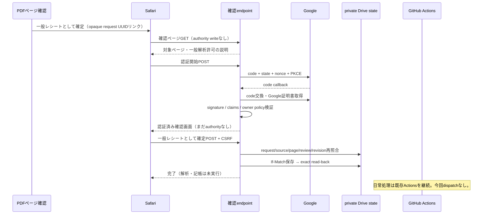

# Human General: 認証付き明示確定（offline candidate）

この実装は認証transportのsynthetic検証用core。公開HTTP endpoint、OAuth client、live state、Apps Script deploymentを作らない。既存onEdit、period guard、定期Actions、privacy閾値を変更しない。liveへの接続は未実施。

## 方式選定

| 方式 | 評価 |
|---|---|
| A: Apps Script Web App | accessing userとして動かせるが、新deployment/source/runtime scopeが必要。getIdentityTokenはeffective userのtokenであり、任意のrequest nonceを指定するAPIがない。独立backendでの署名検証・request bindingも必要になる。今回の最小案としては選ばない。 |
| B: 小さなGoogle OIDC確認endpoint | 採用。authorization code + PKCE、state、nonce、署名検証を一か所に限定できる。ブラウザリンク方式でPCメニュー依存がない。Actions自体はHTTP callback serverではないため、受付endpointだけは別に必要。 |
| C: 現在のDesktop OAuth / Workspace identity | 現在のread-only source取得tokenは明示確定の証拠ではない。Desktop callbackはiPhone導線に向かず、個人アカウントのsimple triggerにWorkspace条件を仮定しない。 |

常設の大きな新backendは作らない。今回追加するのは独立core、offline projection adapter、synthetic testsだけ。将来のHTTPS hostは、少数の認証routeとprotected session/stateに限定する。既存receipt処理の運用方式は変えない。既存の小さな安全なhostで成立しない場合は、そこで停止して再設計する。

## 責務と導線

リンクをタップしたこと、Sheetsの種類セル、Googleログイン成功だけではauthorityを発行しない。対象と許可内容を表示し、認証後の明示POSTが必要。旧「一般」回答を移行しない。unknown/sensitive_unknownかつ既存eligible条件を満たすページのみを対象とし、Medical/payroll/明確PIIは認証成功後も拒否する。automatic classificationは保存前後で不変。

## 実装とidentity

- `app/human_general_auth_transport.py`: GoogleIdentityVerifier、GoogleCodeExchange、AuthRequestStore、AuthenticatedGeneralConfirmation、VerifiedActor。
- `app/human_general_auth_projection.py`: 既存general_review_cardへ確定リンク1項目を追加するoffline adapter。新Sheetなし、onEdit接続なし。まだlive projection rendererへ接続しない。
- `tests/test_human_general_auth_transport.py`: ephemeral RSA秘密鍵はmemoryだけ。Google証明書取得・code exchangeはsynthetic transportに限定し、ネットワークを禁止。

GoogleIdentityVerifierは既存google-authでRS256署名を検証し、証明書取得先をGoogleの固定HTTPS endpointへ限定。issuer、単一audience、azp、exp、iat、nonce、email_verifiedを検証する。自己申告email、未署名token、外部証明書URLを信用しない。実Googleの署名・ログインを取得したテストではなく、Googleと同じ検証codeを通すsynthetic署名テストである。

actorの正本は正規化したissuer + Google sub。emailは署名検証済みclaimであって、allowlist keyではない。owner subをprivate backend設定から1件だけ渡す。codeへ本人email/subを書かず、実値の取得や登録も今回行わない。将来家族を許可する場合は別policy revisionと明示enrollmentを要する。

`verified_actor(request_id) -> VerifiedActor` はprotected request recordから、request digest、UUID、policy revision、現ページfreshnessを再照合して返す。任意のclient JSONをVerifiedActorへ変換しない。既存HumanGeneralConfirmationのcallbackへは、検証済みemailをlegacy_actorとして渡す。既存authority-v1のsubject形式を黙って変更しない。stable actor、method、verified_at、UUID、binding、authority digestを専用private認証stateに保存し、既存authority auditのUUID/digestと照合する二つの正本recordで証跡を固定する。既存grantを別UUIDで返された場合は再調整待ちとして拒否し、新actorの証跡と混同しない。

## request / session / replay

将来の解析consumerも、専用認証stateと既存authority auditのUUID/digest linkage、stable actor policyを読み直す必要がある。legacy grantを認証済み新経路として自動採用しない。後続consumerへのlive接続はこのcandidateには含めない。

request binding: UUID、source_file_id、SHA256、page_count、source_kind、page_number、stable_page_identity、review identity、authority revision、current automatic classification/reason、human kind、extraction/completeness、明確sensitiveフラグ、page処理状態、action=general_receipt。canonical digestへすべて含める。

状態: prepared → authenticating → verifying → authenticated → claimed → complete。

10分の固定期限。state/nonce/CSRF/cookieは暗号学的乱数。stateとnonceは独立。private stateにはhashだけを保存し、raw ID token、access/refresh token、PKCE verifierを保存しない。browser sessionはhost内部のみで保持し、client JSONとして受け取らない。本番multi-instanceではencrypted TTL session storeが必要で、未実装のまま公開しない。

host contract:

- callback URIを固定し、HTTPS、Secure/HttpOnly/SameSite=Laxのhost-only cookieを使用。
- `/confirm` GETは表示のみ。認証開始と確定はPOST。POSTでexact OriginとCSRFを検証する。
- callbackでstate+cookieを照合してからCASでverifyingをclaimし、一度だけcodeを交換する。
- 同URL、callback、確定POSTのreplayは拒否。UUID変更・別pageへの証拠流用も拒否。
- request stateのCASは読んだsnapshotのbytes/ETagに結び付ける。別readに置き換わったETagを使わない。
- strong ETag/If-Match/exact read-backは既存HumanGeneralAuthorityStoreを再利用。412はretryせず、無条件fallbackなし。
- scopeはopenid emailのみ、access_type=offlineを要求せずrefresh tokenは保存しない。
- token/code/query/cookieをaccess log、trace、analytics、artifactへ出さない。エラーは固定reason codeだけ。
- Referrer-Policy=no-referrer、Cache-Control=no-store、CSP、frame-ancestors 'none'、URL allowlist、rate limitをhostで適用する。
- request/linkはauthorityでもbearer grantでもない。漏れてもallowlist ownerの認証と明示確認を省略できない。

原本・page・review・revision・privacy・現状態はprepare、認証前後、確定前、verified_actor、既存confirmationの保存直前にfresh取得する。セルを信頼するcurrent_page/load_source実装を注入しない。source読取は既存Drive service account/private ACL経路だけを使う。

authority保存後に認証stateの完了保存やprojection更新が失敗すると、状態はclaimed/unknownとして保持。ブラウザ再送で再追記しない。復旧workerは同UUIDの既存authority audit/confirmation digestをread-only照合し、判明した結果のみ認証state/projectionへ反映する必要がある。二つのDrive JSONを跨ぐtransactionは仮定しない。復旧worker/HTTP hostは今回まだ作らない。

期限切れの旧リンクは再認証で延命しない。fresh再照合した新requestリンクの再表示が必要。既存のPDF確認カードを含むシート内容は、今回一切変更しない。

## iPhone操作方式

採用: 同じ縦カード内の「一般レシートとして確定」リンク → ブラウザ確認画面 → Google認証 → 明示確定 → 完了表示。PCカスタムメニュー、画像に割り当てたscript、URLコピー貼付け、横スクロールは不要。

Google Sheetsがリンクをアプリ内ブラウザで開く場合、Google OAuthを埋め込みWebViewで実行しない。OSの「Safariで開く」導線を使用する。どのブラウザで開くかはiPhone/Sheets設定に依存するため、1タップで必ずSafariになるとは保証しない。Safariへの安全な遷移が実機で成立しなければlive gateを閉じる。

同directoryの`human-general-auth-mobile.html`はsynthetic対象の幅375px向け静的説明preview。入力枚数欄なし、technical IDなし、1列、48px以上の操作領域。認証・保存機能はない。iPhone実機、Safari cookie/OAuth往復、Sheetsアプリからの遷移は今回未検証。設計方式は決定したが、実機確認済みとは扱わない。

## Apps Script / Actions / 本番設定

選定方式ではApps Script source追加0、manifest変更0、runtime OAuth scope追加0、trigger変更0、deployment追加0、onEdit変更0。既存capture-only候補はliveへ置かない。将来のlink projectionを既存runnerで実施することで、Apps Script管理APIも不要。

通常receipt・銀行・PayPay・Amazon・Medical・定期Actionsは変更しない。認証endpointは確認だけ、Actionsはその後の通常処理だけ。認証POSTからActions/Gemini/writerを起動しない。

本番化前の別設定作業:

1. HTTPS hostと固定redirect URI。既存Desktop clientをWeb redirectに転用せず、既存Web clientを調査し、なければ適切なWeb clientの登録を別承認で行う。
2. Web client ID、client secret（server secret領域のみ）、owner Google sub allowlist、policy revision。
3. 専用private認証request state file/binding/ACL、既存HGA stateへ限定したbackend資格情報。既存stateを無断改変しない。
4. encrypted TTL browser sessions、cookie/CSP/log redaction/rate limit、失敗時read-only recovery。
5. OIDC/Google endpoint設定は固定。Sheetへclient secret/tokenを置かない。endpoint署名secretはこの案では不要で、署名済みGoogle token+protected transport/stateを使用する。
6. 本人sub enrollmentは署名検証と独立した本人確認手順を要する。最初にログインした人を自動owner登録しない。
7. Web clientのlive preflightでPKCEの正しいverifierの成功と、不正/欠落verifierの拒否を確認する。現在のcode交換はsyntheticであり、実GoogleでのWeb client適合確認を代替しない。成立しない場合はPKCEを削除するfallbackをせず停止する。

これらをsynthetic requestだけでlive認証canaryするための準備が次Phase。現時点で公開endpoint/Secret配置は未完了なので、実ページへのlive authority発行や本番writeへは進めない。

## Offline検証結果（2026-10-06）

- 新規認証transport tests: 54ケース。ephemeral RSA署名、許可owner、allowlist外、unsigned/tampered token、issuer/audience/iat/exp/email_verified/nonce、CSRF、別UUID流用、source/page/review/revision/状態変更、Medical/payroll/PII、CAS競合、read-back失敗、完了保存失敗、replay、projectionを検証。
- full Python suite: 4,423 passed。既存Medicalを含む。既存依存ライブラリのdeprecation warning 2件。
- 既存Node suite: 30 passed。compileall、diff checkも成功。
- 実Google OAuth、実iPhone、実Drive authority保存、実Sheet変更は未実施。synthetic成功をlive成功と同一視しない。

## 公式根拠リンク

- [Google OIDC: server flow / state / nonce / sub / signature validation](https://developers.google.com/identity/openid-connect/openid-connect)
- [Web server OAuth](https://developers.google.com/identity/protocols/oauth2/web-server)
- [google-auth ID token verification](https://google-auth.readthedocs.io/en/latest/reference/google.oauth2.id_token.html)
- [Apps Script Web App execution identity](https://developers.google.com/apps-script/guides/web)
- [Apps Script effective-user ID token](https://developers.google.com/apps-script/reference/script/script-app#getIdentityToken())
- [Google OAuth policies: platform clients / embedded user agents](https://developers.google.com/identity/protocols/oauth2/policies)
